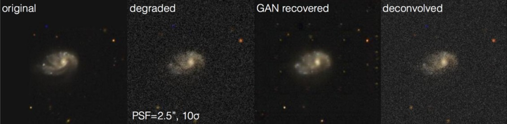
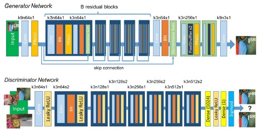
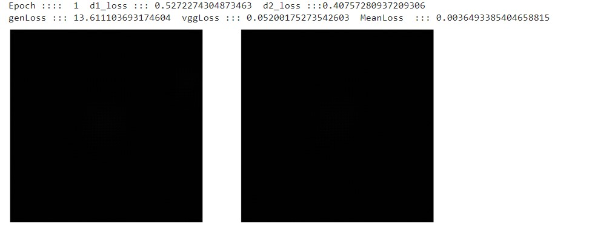
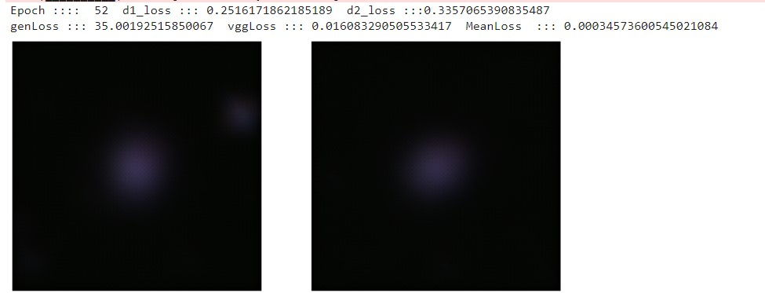
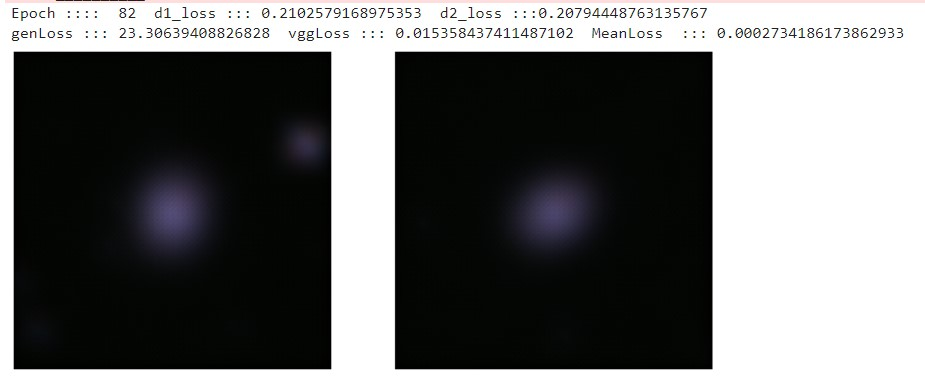
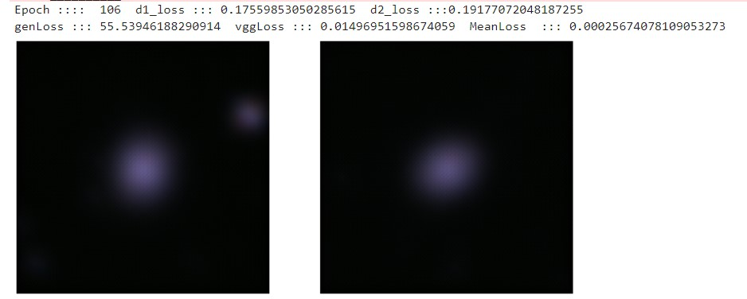

# Astronomical-image-denoiser (AID)

> Astronomical image denoiser is a GAN model that can be used to denoise the noisy astronomical images obtained from space telescopes.

# Need for AID 💡 :

Everyday,thousands of space image data has been collected through years. Even though we have highly efficient devices such as Hubble and to capture the space, as the outer space filled with lot of anonymous particles and due to some device malfunctions, we will not be able to get the clear images of the astronomical objects always. Images are always found with some noise and anomalies.

## Consider this sample :



With the help of a deep learning network GAN (Generative Adversarial Networks) we can denoise the images collected from the space. Also a special type of GAN is being implemented here called Super-Resolution GAN(SRGAN).SRGANs are highly capable of this process to produce a high resolution image .Through this the network when subjected to noised image learns to generate a new image by discriminating the noises in it. Through this we can view an analyse the space images clearly and solve the hidden mysteries of the universe.

# SRGAN Architecture

<p align="center">

</p>

The `requirements.txt` file should list all Python libraries that your notebooks depend on, and they will be installed using

```
pip install -r requirements.txt
```

After training for n number of epochs the results are :

## Epoch 1



## Epoch 50



## Epoch 80



## Epoch 100

After about 100 epochs the resultant image is as follows :



## Contributing to AID

To contribute to <Astronomical-image-denoiser>, follow these steps:

1. Fork this repository.
2. Create a branch: `git checkout -b <branch_name>`.
3. Make your changes and commit them: `git commit -m '<commit_message>'`
4. Push to the original branch: `git push origin <Astronomical-image-denoiser>/<location>`
5. Create the pull request.
